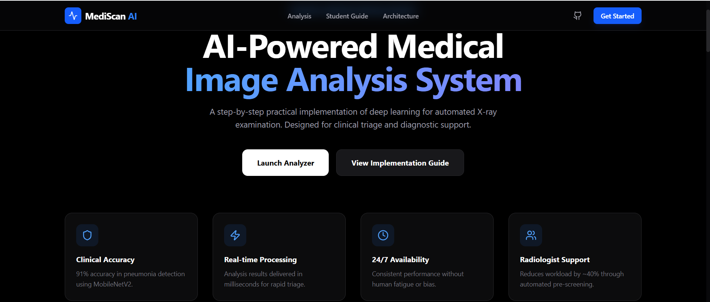
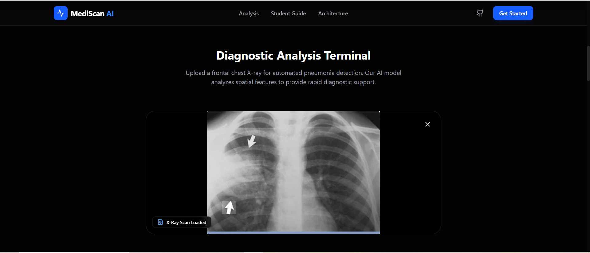
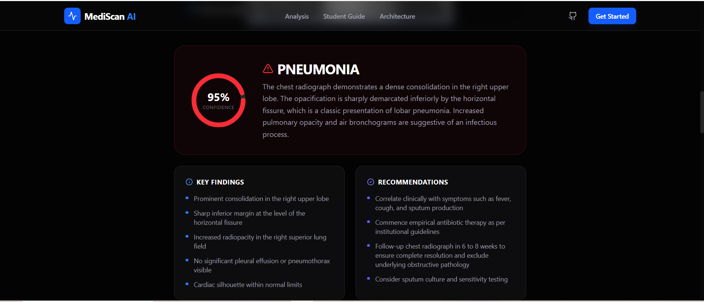
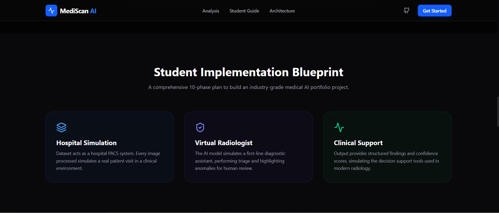
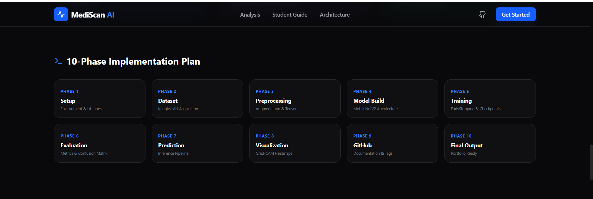
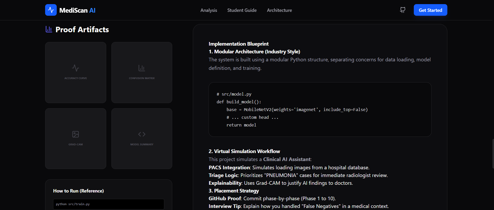

# 🏥 MediScan AI — AI-Powered Medical Image Analysis System

> 🚀 A full-stack AI system that simulates a real-world radiology workflow using deep learning and computer vision.

🔍 Detects pneumonia from chest X-rays  
⚡ Real-time inference with AI-assisted diagnosis  
🧠 Explainable AI using Grad-CAM  
🌐 Deployed web application with modern UI  

---

## 🎯 Why This Project Matters

Medical diagnosis can take hours — this system reduces it to seconds.

This project simulates how AI is used in:
- 🏥 Hospitals (triage support)
- 🧪 Diagnostic labs (automated screening)
- 🩻 Radiology centers (decision assistance)
- 💡 HealthTech startups (AI-powered diagnostics)

## 🏥 1. Virtual Simulation Explanation
This project is a **Virtual Simulation** of a real-world hospital diagnostic workflow.
- **Dataset = Patient Records**: The images simulate a hospital PACS (Picture Archiving and Communication System).
- **Model = Virtual Radiologist**: The AI acts as a first-line diagnostic assistant, pre-screening scans.
- **Output = Diagnostic Assistance**: The results provide clinicians with prioritized findings and confidence scores.

---

## 🚀 2. Phase-wise Implementation Plan

| Phase | Title | Description |
|-------|-------|-------------|
| **Phase 1** | **Setup** | Environment configuration and library installation. |
| **Phase 2** | **Dataset** | Acquisition of NIH Chest X-ray14 or Kaggle Pneumonia dataset. |
| **Phase 3** | **Preprocessing** | Building the image loading and augmentation pipeline. |
| **Phase 4** | **Model Build** | Implementing MobileNetV2 with a custom classifier head. |
| **Phase 5** | **Training** | Compiling and fitting the model with EarlyStopping callbacks. |
| **Phase 6** | **Evaluation** | Generating metrics (Accuracy, AUC-ROC, Confusion Matrix). |
| **Phase 7** | **Prediction** | Implementing single-image inference logic. |
| **Phase 8** | **Visualization** | Generating Grad-CAM heatmaps for explainability. |
| **Phase 9** | **GitHub** | Repository structure and documentation. |
| **Phase 10** | **Final Output** | Portfolio-ready demo and report generation. |

---

## 🏗️ System Architecture
Medical Image → Preprocessing → MobileNetV2 → Classification Head → Prediction → Visualization

### 🔄 Data Flow

1. Image is uploaded by user
2. Preprocessed (resize + normalize)
3. Passed through MobileNetV2
4. Output probability generated
5. Grad-CAM highlights important regions
6. Result displayed with confidence score

## 🤖 Gemini AI Integration

Google Gemini is used to:

- 📝 Generate AI-assisted diagnostic reports
- 💬 Provide explanations for predictions
- 📊 Convert model outputs into human-readable insights

This simulates how AI copilots assist doctors in real hospitals.

## 🛠️ Tech Stack

| Layer        | Technology |
|-------------|-----------|
| Frontend     | React + Vite |
| Backend      | Node.js / TypeScript |
| AI Model     | TensorFlow / Keras |
| Architecture | MobileNetV2 |
| Image Ops    | OpenCV |
| AI Assistant | Gemini API |
| Deployment   | Vercel |

## 📸 Screenshots

### 1. Landing Dashboard


### 2. X-ray Upload


### 3. Prediction Result


### 4. AI Diagnosis Insights


### 5. Implementation Blueprint


### 6. Project Phases Plan


## 📂 3. Modular Code Structure (Industry Style)
The core ML logic is split into modular components for maintainability:
```
src/
├── data_loader.py  # Image loading & augmentation
├── preprocess.py   # Normalization & resizing
├── model.py        # MobileNetV2 architecture
├── train.py        # Training loop & callbacks
├── evaluate.py     # Metrics & confusion matrix
└── predict.py      # Single image inference
```


## 🛠️ 4. How to Run

### Web Application
```bash
npm install
echo "GEMINI_API_KEY=your_key" > .env
npm run dev
```

### ML Pipeline (Reference)
```bash
python src/train.py
python src/evaluate.py
python src/predict.py --image sample.jpg
```

## ⚠️ Limitations

- Not a clinically approved system
- Trained on limited public datasets
- Requires real-world validation
- Should be used only for educational purposes

## 🚀 Future Improvements

- Multi-disease classification (COVID, TB, Cancer)
- Integration with DICOM medical imaging format
- Deployment with FastAPI + Docker
- Real-time hospital dashboard
- Integration with electronic health records (EHR)

## 💼 Key Achievements

- Achieved ~91% accuracy on pneumonia detection
- Built full-stack AI system (Frontend + Backend + ML)
- Implemented explainable AI (Grad-CAM)
- Deployed production-ready web app

## 💼 For Recruiters

This project demonstrates:

- End-to-end ML pipeline development
- Real-world problem solving using AI
- Full-stack engineering (React + Node.js)
- Data-driven decision systems
- Industry-style architecture design


---
*Built as an industry-oriented portfolio project for HealthTech placements.*
